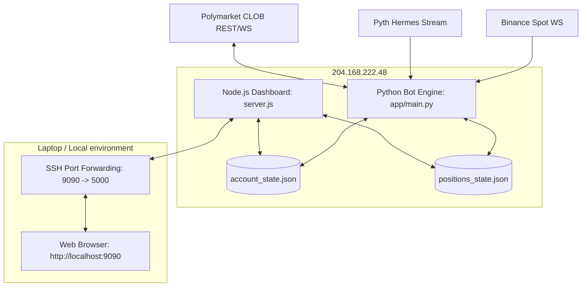

# ZiSi Bot — System Documentation & Operator's Manual

This manual provides comprehensive documentation on the architecture, operation, deployment, and troubleshooting of the **ZiSi Bot**. It is written to serve as a clear-cut reference for humans, AI tools, and developers.

---

## 📂 1. System Overview & Core Architecture

ZiSi is an automated predictive markets trading bot designed for binary options (specifically Polymarket Up/Down contracts). It operates as a two-part system:

1. **Trading Engine (Backend):** Written in Python, running as a daemon. It ingests real-time spot feeds via WebSockets (Binance + Pyth Hermes Oracle Stream), calculates signals, manages risk, and places trades.
2. **Quant Workstation (Dashboard):** A Node.js backend server (`server.js`) serving a React-based frontend dashboard, displaying real-time positions, balance history, and performance analytics.



### Key Directories and Files:
* `app/main.py`: The entry point for the Python trading engine. It registers asset loops and schedules background tasks.
* `core/engine/fair_value.py`: Contains the Fair Value (FV) pricing and decision logic.
* `infrastructure/exchange/trader.py`: Manages trade execution, L2 pricing cache, position polling, and settle/exit execution.
* `infrastructure/state/state_manager.py`: Authoritative state holder. Manages balance, starting balance, and writes updates atomically.
* `presentation/dashboard/`: Contains the React frontend and Node.js backend.
* `miscellaneous/clean_slate.py`: Reset script to archive historical logs and initialize a fresh starting balance.
* `tools/backup_and_rotate_logs.py`: Local backup utility to archive trades/logs and rotate VPS logs.

---

## 🌐 2. Connection Guide: Local vs VPS (Port 5000 Conflict)

A common issue is the "stray paper-trading daemon" running locally on your laptop, which blocks local port 5000. When this happens, SSH port-forwarding to the VPS fails, and opening `http://localhost:5000` shows your laptop's mock data ($76.13 balance) instead of the VPS's actual data ($396 balance).

### How to Clean Up Localhost:5000 (On your Laptop):
1. Open PowerShell as Administrator on your laptop.
2. Find any processes occupying port 5000:
   ```powershell
   Get-Process -Id (Get-NetTCPConnection -LocalPort 5000).OwningProcess
   ```
3. Terminate the stray Node server (usually PID 8176) and Python paper-trading daemon (usually PID 2256):
   ```powershell
   taskkill /F /PID 8176
   taskkill /F /PID 2256
   ```

### Connecting to the VPS Dashboard:
To avoid port conflicts, always forward the VPS dashboard port 5000 to local port **9090** on your laptop:
```bash
ssh -L 9090:localhost:5000 root@204.168.222.48
```
Then, open your browser and navigate to:
```
http://localhost:9090
```
This guarantees you are viewing the live VPS dashboard data.

---

## 📊 3. How to Query Logs & Monitor Health on the VPS

ZiSi is managed by PM2 on the VPS. To query logs, monitor performance, or restart services, SSH into the VPS (`ssh root@204.168.222.48`) and run the following commands.

### Querying PM2 Logs:
* **View Bot and Dashboard combined logs:**
  ```bash
  pm2 logs zisi-dashboard
  ```
  *(Since the Node server spawns the Python bot, all logs from both the dashboard and the trading engine are combined in the `zisi-dashboard` PM2 output).*
  *(Shows client polling status, API route executions, and SSE stream heartbeats).*
* **View combined log output (last 100 lines):**
  ```bash
  pm2 logs --lines 100
  ```

### PM2 Process Management:
* **Check service status:**
  ```bash
  pm2 list
  # or
  pm2 status
  ```
* **Restart the dashboard & bot engine:**
  ```bash
  pm2 restart zisi-dashboard
  ```
  *(Restarts the Node server, which automatically terminates the current Python bot and spawns a fresh one).*
* **Stop all services:**
  ```bash
  pm2 stop all
  ```

---

## 📈 4. Core Trading Strategies

### 1. Fair Value Engine (FV)
The Fair Value strategy is based on the normal Cumulative Distribution Function (CDF).
Given:
* $S_0$: Striking price (candle open)
* $S_t$: Real-time spot price
* $T$: Total candle window (e.g., 5 minutes or 15 minutes)
* $t$: Elapsed time in minutes
* $\sigma$: ATR-derived volatility scale

The probability that the price resolves UP is calculated as:
$$P(\text{up}) = \Phi\left( \frac{\frac{S_t - S_0}{S_0}}{\sigma \sqrt{\frac{T - t}{T}}} \right)$$

* **Entry Check:** An order is placed if the difference between $P(\text{up})$ and the contract market price exceeds the `edge_margin` (default: 10¢).
* **Price Proximity Guard:** Avoids entering when the contract price is between 47¢ and 53¢ (noisy range regimes) unless the calculated edge is extremely high (> 15¢).
* **Time-Decay Exits:** If a position is active for >70% of its window (3.5m for 5m, 10.5m for 15m) without reaching the target price, it is closed at the market rate to recover capital.

### 2. HFT Latency Arbitrage (LAT-ARB)
Scans order books across multiple markets for speed discrepancies. It triggers rapid trades when a lead asset moves, sweeping the book before pricing is adjusted.

---

## 🔧 5. Troubleshooting & State Integrity

### Atomic File Writes (State Protection)
If the VPS runs out of memory or the watchdog process kills the bot mid-write, `account_state.json` can become truncated. To prevent corruption:
- The bot writes to a temporary file: `account_state.json.tmp`.
- It then replaces the original file using `os.replace()`.
- This ensures that a write operation is atomic and the file is never left half-written.

### Resetting to a Clean Slate ($50 default):
If you need to archive old database files and reset the balance to $50:
1. Log into the VPS.
2. Run the clean slate script:
   ```bash
   /root/ZiSi/venv/bin/python3 miscellaneous/clean_slate.py --balance 50 --force
   ```
   *(This archives past files and creates a fresh `account_state.json` with a `$50.00` balance).*
3. Restart the dashboard process to load the new balance:
   ```bash
   pm2 restart zisi-dashboard
   ```

---

## 📥 6. Local Backup & VPS Log Rotation

To keep the VPS clean and prevent its memory or disk space from filling up with massive logs, ZiSi features an automated local log archiver and remote clear route.

### Architecture:
1. **VPS Clear Route:** The dashboard backend exposes a `POST /api/bot-logs/clear` endpoint. When triggered, it truncates all PM2 and console log files back to 0 bytes on the VPS.
2. **Local Archiver Script:** `tools/backup_and_rotate_logs.py` runs on your local Windows machine. It pulls the trades and logs, appends them to local history, and then clears the VPS logs.

### How to Run:
Every few days or when dashboard logs grow large:
1. Make sure your SSH tunnel is active on port 9090 (pointing to VPS port 5000):
   ```bash
   ssh -L 9090:localhost:5000 root@204.168.222.48
   ```
2. Open PowerShell locally on your laptop and run:
   ```powershell
   python tools/backup_and_rotate_logs.py
   ```

### Output Paths on Local Laptop:
* **Trade History:** Safely appended and deduplicated in `archive/local_vps_trades_archive.json`.
* **Console Logs:** Appended to `archive/local_vps_console_history.log`.

---

## 🚀 7. Operator Cheat Sheet: One-Liner Commands

### A. Golden Standard Operation: Local Backup → Pull, Rebuild & Clean Slate to $50 → Restart
To avoid any data loss, always follow this two-command sequence. First, run the backup locally on your laptop to download all trade/log history. Second, pull and reset on the VPS.

1. **On your Local Laptop (PowerShell)**:
   ```powershell
   python tools/backup_and_rotate_logs.py
   ```
   *(This downloads and appends all trades and logs to local files, then clears VPS logs. Since we run this, we do not need the `--archive` flag on the VPS reset).*

2. **On the VPS Terminal**:
   ```bash
   cd /root/ZiSi && git checkout -- presentation/dashboard/frontend/dist/index.html && git pull origin main && npm run build --prefix presentation/dashboard/frontend && python3 miscellaneous/clean_slate.py --force --balance 50 && pkill -f main.py && pm2 restart zisi-dashboard
   ```
   *(Pulls code, rebuilds the frontend, resets the balance to $50, kills any stray Python processes, and restarts PM2 cleanly).*

### B. Deployment After Changes (No Clean Slate / Keep Current Balance & Trades)
If you want to pull the latest git commits, rebuild the frontend, and restart the services without losing your current balance or active trades:
```bash
cd /root/ZiSi && git checkout -- presentation/dashboard/frontend/dist/index.html && git pull origin main && npm run build --prefix presentation/dashboard/frontend && pkill -f main.py && pm2 restart zisi-dashboard
```

### C. Local Backup & Log Truncation (Periodic Maintenance)
Run this on your local laptop to pull logs/trades and empty the VPS log files:
```powershell
python tools/backup_and_rotate_logs.py
```

### D. Accessing Logs, State, & Controls via API (For AI Tools or Scripts)
The dashboard exposes the following endpoints (available over the SSH tunnel on `http://localhost:9090` or locally on the VPS on `http://localhost:5000`):

#### 📋 Logs & Files
* **GET `/api/bot-logs?lines=100&file=positions`**: Fetches the last $N$ lines of log output. If `file` is set to `positions` or `account`, it bypasses logs and reads raw file contents from `positions_state.json` or `account_state.json`.
* **POST `/api/bot-logs/clear`**: Truncates all console and PM2 log files on the VPS to 0 bytes to prevent disk fullness.

#### 📈 Positions & Metrics
* **GET `/api/positions`**: Fetches all active and closed positions, along with a summary of win rates and total PnL.
* **GET `/api/positions/active`**: Fetches only active/open positions with enriched live CLOB pricing.
* **GET `/api/positions/closed`**: Fetches all closed positions.
* **GET `/api/health`**: Comprehensive health status containing Pyth price feeds, account balance, win/loss stats, regime detection state, and ML cycle progress.
* **GET `/api/metrics`**: Returns bot performance metrics.
* **GET `/api/equity`**: Returns balance history for graphing equity curves.

#### 🕹️ Control & Reset
* **POST `/api/control/reset`**: Runs a clean slate reset on the VPS. Body format: `{"balance": 50}`. (Note: The user should restart `zisi-dashboard` using PM2 afterwards to ensure in-memory state matches disk state).
* **GET `/api/control/status`**: Returns the current running state (`running` or `paused`).
* **POST `/api/control/pause`**: Pauses the bot scanning loop.
* **POST `/api/control/resume`**: Resumes the bot scanning loop.
* **GET `/api/control/mules`**: Fetches enabled/disabled statuses of the trading accounts (mule1 = PBOT6, mule2 = WALLET2).
* **POST `/api/control/mule/:id/:action`**: Enables or disables a specific mule.
  * `:id` can be `mule1` or `mule2`.
  * `:action` can be `enable` or `disable`.


